# DApp zjubca.bounty
##1 DApp概述
zjubca.bounty是一个任务管理的DApp，可用于小型组织或企业内部简单任务分配或项目管理。用户可以在DApp内完成针对任务的一系列操作。从功能上讲，其实现了任务的创建、删除、编辑更新、验收及赏金（完成任务的奖励）分配。从技术上讲，zjubca.bounty前端使用**React**进行开发，并使用**BootStrap**来适配移动端；后端智能合约基于EOS区块链。**本文档，首先对源码进行讲解、对设计进行分析，最后进行系统的演示**。其中后端不仅实现在本地进行部署，还部署到了**EOS Kylin**测试网，系统演示录制了视频:https://www.bilibili.com/video/av75651876 

我们的整个DApp是面向任务的，我们将任务的生命周期划分为：

* 认领期（Before Executing）：任务创建者创建一项悬赏任务，任务默认进入认领期。在此期间，创建者可以**删除任务**。而普通用户可以在此阶段可以**参加任务**、**退出任务**。任务创建者认为任务参与人数足够后可以将任务转为执行期。 

* 执行期（In Executing）：执行期时任务参与者**无法退出任务**，任务创建者也**无法删除任务**（如果一定要退出、删除任务，需要先将任务状态倒置回认领期）。当创建者任务任务在实际中完成到一定程度后，可以将任务转为验收期。

* 验收期（After Executing）：此时任务创建者可以进行**赏金（任务奖励）分配**以及对参与者**进行评分**。验收完成后，创建者可将任务转为完成阶段。

* 完成（Done）：在此阶段无法进行任何操作，任务就此结束。可以公示每个参与者的奖励分配和评分，也可以不公示。

参与者也可以对任务进行评价（**点赞**或**点踩**），且该操作在任何时期都可以进行。

## 2 代码实现

### 2.1 后端
zjubca.bounty的后端，即智能合约，基于EOS区块链技术。

EOS是除了以太坊ETH以外最有名的公链技术，其使用了DPoS共识算法，产生区块的节点（Block Producer）固定为21个，所有持有EOS代币的用户可以进行投票来决定哪些节点能成为BP（区块生产者）。EOS使用NET、CPU、RAM三种资源的租赁来取代ETH的gas机制。EOS支持多重签名，且支持已部署智能合约的更新。EOS的智能合约主要使用C++进行开发。

我们的DApp的后端主要包括Task智能合约，一共有大约500行代码。EOS智能合约是基于C++的，一个EOS智能合约包括.cpp和.hpp两个文件。编译之后生产.wasm和.abi文件。
#### Task合约
**1）数据结构：**

```c
struct [[eosio::table]] task {
  uint64_t id;
  string title;
  string description;
  string status;
  string rolenumbers;
  string reward;
  string pledge;
  string updatedat;
  string requires;
  //取消了author属性，默认participants[0]是task的author
  vector<user> participants;

  string likevote;
  string hatevote;

  uint64_t primary_key() const { return id; }
};
typedef multi_index<N(task), task> taskIndex;
```
Task合约主要定义了task这个结构体，显然，task是用来描述一个任务的数据结构，其中各项属性都很好理解。rolenumbers是参与人数，likevote和hatevote是对某个任务进行点赞或点踩的数量以表示对这个任务的评价。task这个struct加了[[eosio::table]]关键字，表明其之后要进行持久化存储，所以需要制定主键primary_key，这里制定的是id属性。

最后一句```typedef multi_index<N(task), task> taskIndex;```在EOS中定义了一个multi_index table。其是EOS上的数据持久化策略。借助这行代码，我们可以实现任务数据在EOS区块链上的持久存储。

**2）合约方法：**
EOS使用```[[eosio::action]]```来表示智能合约中可以被调用的方法。我们在合约中一共实现了create、erase、selectitems、selectatask、update、updatestatus、updatevotes、participate、withdraw、allocateb方法。其函数原型及作用见下（Task.hpp）：

```c
// 新建一个任务：
[[eosio::action]]
void create(const account_name author, uint64_t id, string& authorname,  string& title, 
string& description, string& status, string& rolenumbers, string& reward, string& pledge, string& updatedat, 
string& requires, string& likevote, string& hatevote);
// 删除一个任务：
[[eosio::action]]
void erase(const account_name author, uint64_t task_id);
// 查询一个任务（通过filter和value来进行筛选）：
[[eosio::action]]
void selectitems(const account_name author, string& filter, string& judge, string& value);
// 查询一个任务（通过id直接来查找）：
[[eosio::action]]
void selectatask(const account_name author, uint64_t task_id);
// 更新一个任务：
[[eosio::action]]
void update(const account_name author, uint64_t id, string& title, string& description, string& status, 
string& rolenumbers, string& reward, string& pledge, string& updatedat, string& requires);
// 更新一个任务的状态：
[[eosio::action]]
void updatestatus(const account_name author, uint64_t task_id, string& status);
// 更新一个任务的投票情况：
[[eosio::action]]
void updatevotes(const account_name author, uint64_t task_id, string& likevote, string& hatevote);
// 参加一个任务：
[[eosio::action]]
void participate(const account_name author, uint64_t task_id, string& participantname);
// 退出一个任务：
[[eosio::action]]
void withdraw(const account_name author, uint64_t task_id, string& participantname);
// 验收一个任务并进行任务奖励分配：
[[eosio::action]]
void allocateb(const account_name author, uint64_t task_id, string& participantname, string distribution, string score);
```

在Task.cpp中我们实现了以上所有的原型，而且都是带有debug的print输出的。**我们实现了针对任务数据的增、删、改、查的全部操作**。**我们也实现了针对任务的参加、退出操作**。最后我们还实现了验收任务——结束任务周期的**验收操作**。

**3）重要的合约方法的讲解：**

**create方法（创建任务，代码讲解见注释）：**

```c
[[eosio::action]]
void Task::create(const account_name author, uint64_t id, string& authorname,  string& title, string& description, string& status, string& rolenumbers, string& reward, string& pledge, string& updatedat, string& requires, string& likevote, string& hatevote){
	// 进行权限验证（用author账户来发起create操作者是否就是author的本人）：
  require_auth( author ); 
  // 获取持久化任务存储的实例【tasks table】：
  Task::taskIndex tasks(_self, _self); 
  // 通过task的id进行检索，以进行判断任务是否存在，如果【存在】就eosio_assert：
  auto iterator = tasks.find(id);
  eosio_assert(iterator == tasks.end(), "This ID of Task already existed !!!");
	// 写入任务数据：
  tasks.emplace(author, [&](auto& tasks) {
    tasks.id = id;   
    tasks.title = title;   
    tasks.description = description;  
    tasks.status = status;  
    tasks.rolenumbers = rolenumbers;   
    tasks.reward = reward;  
    tasks.pledge = pledge; 
    tasks.updatedat = updatedat;   
    tasks.requires = requires;   
    tasks.likevote = likevote; 
    tasks.hatevote = hatevote; 
  });
  // 重新获取任务的实例：
  iterator = tasks.find(id);
  // 因为task的participants属性不像是int、string这样的基本数据类型，是一个复杂数据，所以需要通过如下方式来写入：
  tasks.modify(iterator, author, [&](auto& tasks) {
    tasks.participants.push_back(user{
    //authorid,
    authorname,
    "0 ZJUBCA",
    "0.0"
    });
  });
  print("{ \"message\":\"Successfully create a task named <strong>",title,"</strong> in ZJUBCA.Bounty!\" }");
}
```

**update方法（更改任务，代码讲解见注释）：**

```c
[[eosio::action]]
void Task::update(const account_name author, uint64_t id, string& title, string& description, string& status,string& rolenumbers, string& reward, string& pledge, string& updatedat, string& requires){
  // 进行权限验证：
  require_auth( author );
  // 获取持久化任务存储的实例【tasks table】：
  Task::taskIndex tasks(_self, _self);
  // 判断任务是否找到/存在，如果【不存在】就eosio_assert：
  auto iterator = tasks.find(id);
  eosio_assert(iterator != tasks.end(), "This ID of Task DID NOT exist !!!");
  // 任务找到后对其进行更新：
  tasks.modify(iterator, author, [&](auto& tasks) {
    tasks.title = title;
    tasks.description = description;
    tasks.status = status;
    tasks.rolenumbers = rolenumbers;
    tasks.reward = reward;
    tasks.pledge = pledge;
    tasks.updatedat = updatedat;
    tasks.requires = requires;
  });
  print("{ \"message\" : \" Successfully updated. \"}");
}
```

**selectitems方法（代码讲解见注释，这个方法是用来查询task数据的）：**

```c
void Task::selectitems(const account_name author, string& filter, string& judge, string& value){
  // 进行权限验证：
  require_auth( author );
  // 获取持久化任务存储的实例【tasks table】：
  Task::taskIndex tasks(_self, _self);
  int task_id = 1;
  for(task_id = 1; ; task_id++){
    auto iterator = tasks.find(task_id);
    if(iterator == tasks.end()){
      break;
    }
  }
  int length = task_id - 1;
  // 对filter的情况进行判断：
  if(filter=="*"){
    print("{\"tasks\":[");
    for(int task_id = FIRST_TASK_ID; task_id <= length ;task_id++){ 
      // 将task的所有信息打印出来：
      printask(task_id);
      if(task_id!=length){
        print(",");
      }
    }
    print("]}");
  }else{
    int lastTaskMatched = 0; // Used as a end flag(Sentry) of matched task array.
    if(filter=="tasktitle"){ // 如果想以tasktitle为关键词来对任务进行查询
      if(judge=="equal"){ 	 // 如果条件是相等
        print("{\"tasks\":[");
        for(int task_id = FIRST_TASK_ID; task_id <= length ;task_id++)
          if(tasks.get(task_id).title.c_str()==value)
            lastTaskMatched = task_id;
        for(int task_id = FIRST_TASK_ID; task_id <= length ;task_id++){
          auto thetask = tasks.get(task_id);
          if(thetask.title.c_str()==value){
            printask(task_id);
            if(task_id!=lastTaskMatched){
              print(",");
            }
          }
        }
        print("]}");
      }else{
        print("{ \"message\": \"filter == tasktitle, but judge failed.\" }");
      }
    }else if(filter=="taskstatus"){ // 如果想以taskstatus为关键词来对任务进行查询
      ...// 剩余100多行、多个嵌套if-else语句。
    }
 }
```

**participate方法（代码讲解见注释，用来参加一个任务）：**

```c
[[eosio::action]]
void Task::participate(const account_name author, uint64_t task_id, string& participantname){
  require_auth( author );
  Task::taskIndex tasks(_self, _self);
  // 获取持久化任务存储的实例【tasks table】：
  auto iterator = tasks.find(task_id);
  eosio_assert(iterator != tasks.end(), "This ID of Task DID NOT exist !!!");
  // 获取本任务的实例：
  auto thetask = tasks.get(task_id);
  bool existflag = false;
  // 判断participantname是否本来就是参与者：
  if (thetask.participants.size() > 0) {
    for (uint32_t i = 0; i < thetask.participants.size(); i++) {//i = 1 => i = 0
      if(thetask.participants.at(i).username.c_str()==participantname)
        existflag = true;
    }
  } else {
    print("{\"message\" : \"participants attribute undefined.\" }");
  }
	
  // 如果participantname已经参加了本任务：
  if(existflag){
    print("{ \"message\" : \" Participant ALREADY exists! \"}");
  }else{  
    // 如果participantname未参加本任务：
    iterator = tasks.find(task_id);
    tasks.modify(iterator, author, [&](auto& tasks) {
      tasks.participants.push_back(user{
        participantname,
        "0 ZJUBCA",
        "0.0"
      });
    });
    print("{ \"message\" : \" Successfully add a participant. \"}");
  }
}
```

**withdraw方法（代码讲解见注释，用来退出一个任务）：**
退出任务和加入任务前面部分是差不多的，但是在找到具体任务、并判断是任务的参与者之后：

```c
if(existflag){
    iterator = tasks.find(task_id);
    tasks.modify(iterator, author, [&](auto& tasks) {
        auto match_paticipate ([participantname](user p) { return p.username == participantname;});
         // 使用C++ STL里提供的remove_if操作初步删去participant的内容：
        const auto new_end(
            remove_if( begin(tasks.participants),
            end(tasks.participants),
            match_paticipate )
        );
      	// 使用C++ STL里针对vector的erase的操作来正式删除参与者的全部信息：
        tasks.participants.erase(new_end, end(tasks.participants));
    });
    print("{ \"message\" : \" Successfully withdraw a participant. \"}");
}else{
  	print("{ \"message\" : \" Participant DID NOT exist! \"}");
}
```

**erase方法（代码讲解见注释，用来删除一个任务）：**

```c
[[eosio::action]]
void Task::erase(const account_name author, uint64_t task_id){
  require_auth( author );
  Task::taskIndex tasks(_self, _self);
  auto iterator = tasks.find(task_id);
  auto thetask = tasks.get(task_id);
	
  string tasktitle = thetask.title;
  eosio_assert(iterator != tasks.end(), "This ID of Task DID NOT exist !!!");
  // 找到任务后直接调用erase删去之：
  tasks.erase(iterator);
  print("{ \"message\" : \" Successfully erase a task titled ", tasktitle, ". \" }");
}
```

**allocateb方法（代码讲解见注释，用来分配任务验收阶段的奖金）：**

```c
[[eosio::action]]
void Task::allocateb(const account_name author, uint64_t task_id, string& participantname, 
    string distribution, string score){
  require_auth( author );
  Task::taskIndex tasks(_self, _self);
  auto iterator = tasks.find(task_id);
  eosio_assert(iterator != tasks.end(), "This ID of Task DID NOT exist !!!");
  auto thetask = tasks.get(task_id);
  string tasktitle = thetask.title;

  bool existflag = false;
  if (thetask.participants.size() > 0) {
    for (uint32_t i = 0; i < thetask.participants.size(); i++) {
      if(thetask.participants.at(i).username.c_str()==participantname){
        existflag = true;
        // 找到任务 且 找到对应参与者后直接修改其分配(distribution)数量及完成评分(score)
        tasks.modify(iterator, author, [&](auto& t) {
            t.participants.at(i).distribution = distribution;
            t.participants.at(i).score = score;
        });
        print("{ \"message\" : \" Successfully allocateb for participant----", participantname, " at task ", tasktitle, " . \"}");
      }
    }
  } else {
    print("{\"message\" : \"participants size <= 0 .\" }");
  }
  if(!existflag){
    print("{ \"message\" : \" Participant DID NOT exist! \"}");
  }
}
```

### 2.2 前端
我们的前端基于React、bootstrap编写，一共大约2k行代码。

**React** 是一个Web前端的框架。前端的本质问题是如何将来源于服务器端的动态数据和用户的交互行为高效地反映到复杂的用户界面上。React使用了虚拟DOM、状态、单向数据流等设计理念，形成以组件为核心，用组件搭建UI的开发模式，完美地将数据、组件状态和UI映射到一起，极大地提高了开发大型Web应用的效率。React支持ES6语法。

**Bootstrap** 简单来说是一个UI库。使用Bootstrap里的UI控件开发的Web应用，不仅能在PC浏览器上很好的呈现，而且在移动端的浏览器上也能自动进行适配。所以只需要编写一次前端，在手机、PC上都能有良好的UI呈现效果。

除此之外，我们还需要用到 **ScatterJS** 库，里面有能够拉起EOS钱包来对交易进行签名的函数。所有符合Scatter协议开发出来的EOS钱包都支持 **ScatterJS**（市面上比较有名的EOS钱包都符合这个协议）。因为ScatterJS库里已经使用EOS提供的与节点进行通信的RPC API，所以使用ScatterJS里的函数也能实现与节点进行交互。

**zjubca.bounty前端的功能主要有：**

1. 发送交易到区块链：包括构造交易、拉起钱包软件对交易进行签名、发送交易给节点。
2. 读取区块链上的数据：通过rpc向区块链节点请求数据。
3. GUI：提供给用户进行交互的界面。

前端项目结构（frontend目录下，略去了不是我们自己编写的文件以及build时产生的文件）：
```   
├── package.json 				// 包信息
├── public
│   ├── favicon.ico
│   ├── index.html
│   ├── manifest.json
│   ├── style.css
│   └── zjubca.png
└── src
    ├── index.js
    ├── App.js
    ├── components  	// 所有自主编写的组件：
    │   ├── Context.js
    │   ├── Header.js
    │   ├── Home.js
    │   ├── ParticipantItem.js
    │   ├── RankItem.js
    │   ├── RankList.js
    │   ├── Task.js
    │   ├── TaskEditor.js
    │   ├── TaskFilter.js
    │   ├── TaskItem.js
    │   ├── TaskList.js
    │   ├── TaskView.js
    │   ├── TasksView.js
    │   └── style.css
    ├── service     // 自主编写的通信模块：
   	│ 	└── EosComm.js
    ├── images
    │   ├── hate.png
    │   ├── like.png
    │   ├── loading0.gif
    │   ├── loading1.gif
    │   └── zjubca.png  
    └── utils
        └── date.js
```

由于整个前端一共2k行代码，加上各种控件相互组合，还是有点复杂的，以下只分析整个项目的结构和部分重要的代码。

#### 2.2.1 整体分析
整个前端的从 public/index.html 开始，public目录是使用 **create-react-app** 这个工具创建一个 React 项目时自动生成的。index.html 最重要的部分是，在< body >标签里定义了一个```id="root"```的< div >标签。之后的所有JS文件都是针对这个< div >进行的。

然后就要看到 src/index.js 了，其只有一行代码：
```javascript
ReactDOM.render(<App />, document.getElementById("root"));
```
其作用就是引入```App```组件，然后将其添加到```id="root"```的元素下（就是index.html中的那个div）。

```App```组件在 src/App.js 中定义：

```jsx
class App extends Component {
  // 组件在被创建时，最先被被调用的函数：
  constructor(props){
    super(props);
    this.state = {
      loginAccount: null
    };
    this.eoscomm = new EosComm();  
    window.eoscomm = this.eoscomm;
  }
	// 组件在被创建时，constructor后、render前会被调用的函数：
  componentWillMount(){
    this.eoscomm.connectAndLogin(false).then(loginAccount=>{
      window.loginAccount = loginAccount;
      sessionStorage.setItem("userName",window.loginAccount.name);
      this.setState({
        loginAccount: loginAccount
      });
      console.log("window.loginAccount",window.loginAccount);
    });
  }
	// 组件在被创建时的渲染函数，会把控件呈现出来：
  render() {
    return (
        <Router>
          <Switch>
            <Route exact path="/" component={Home} />
            <Route path="/tasks" component={Home} />
            <Route path="/ranklist" component={RankList} />
          </Switch>
        </Router>
    );
  }
}
```

每个React控件都要继承**Component**类。Component类里有几个非常重要的关乎组件生命周期的函数，在**组件创建**时，这些函数会按顺序被调用，按调用顺序分别为：constructor、componentWillMount、render、componentDidMount。创建一个组件时，分别会调用这四个函数。而当组件加载完毕，但是因为**组件状态更新**，需要对组件进行**重新渲染**时，会按顺序调用：componentWillReceiveProps、shouldComponentUpdate、componentWillUpdate、render、componentDidUpdate这些函数。其中只有**render**是一个组件必须实现的函数，其他的看自己情况决定是否实现，如果实现了，就按这些顺序来依次进行调用（React自动完成）。

```App```控件在被创建时会调用 constructor 方法，该方法内进行了一些初始化的操作。然后React会自动调用组件的 componentWillMount 方法，该方法使用**eoscomm**的**connectAndLogin**方法来进行**拉起钱包的操作，返回了使用的EOS账户。**

eoscomm是**EosComm**类的实例，定义位于 src/service/EosComm.js下。**我们专门把与区块链进行交互的所有内容封装到了EosComm类中，包括对交易的签名、向节点发起RPC请求等。**

之后，```App```控件会调用 render 方法，在该方法中返回了```Router```控件（内嵌了```Switch```控件和```Route```控件）

在传统的Web应用中，浏览器根据地址栏的URL向服务器发送一个HTTP请求，一个URL对应一个HTML页面。一个Web应用包含多个HTML页面，于是被称为**多页面应用**。多页面应用的一个弊端是，每次页面切换都会向服务器发送一次请求，HTML返回后也会在浏览器端进行一次页面刷新。

使用**React Router**是一种前端路由的实现方法，能够实现**单页面应用，**使得Web用上去和多页面一样，但是当URL改变后只会向服务器请求部分数据，返回后会改变原来呈现的HTML文件，而不是加载新的页面。使用**React Router**可以让Web应用根据不同的URL渲染不同的组件。

```Router```控件注册路由服务，而```Route```控件实例化实际的路由选项。这里第一个```Route```控件的含义就是当URL是```/```的时候，渲染```Home```控件。```Switch```控件的作用是同时只能渲染一个组件，这样一来当URL是```/ranklist```时不会渲染```/```，而只渲染```/ranklist```情况下的组件。

```Home```组件定义在 ```src/components/Home.js``` 下，其作用是起到一个呈现DApp默认首页的作用：

```jsx
class Home extends Component {
  constructor(props) {
    super(props);
    this.state = {
      userName: sessionStorage.getItem("userName"),
      tasks: [],
      newTask: false
    };
    this.handleLogout = this.handleLogout.bind(this);
  }
  
  render() {
    const { match, location } = this.props; //是系统自带的2个属性。
    const userName = sessionStorage.getItem("userName");
    return (
      <div style={{paddingTop: 120, paddingBottom:120}}>
        <Header
          userName={userName}
          onLogout={this.handleLogout}
          location={location}
          myRank={-1}
          myGPAPlus={-1}
        />
        <Route
          path={match.url}
          exact
          render={ props => <TaskList userName={userName} {...props} /> }
        />
        <Route
          path={${match.url}/:id}
          render={ props => <Task userName={userName} {...props} /> }
        />
      </div>
    );
  }
}
```

具体来说，其主要是调用```Header```控件来显示页面的顶栏。然后注册了两个```Route```分别用来匹配```Task```和```TaskList```控件。

```TaskList``` 控件在 ```src/components/TaskList.js``` 下，其作用是**呈现和管理**全部任务数据。

```Task``` 控件在 ```src/components/Task.js``` 下，其作用是**呈现和管理**某个任务的详细数据。

```Home``` 控件会根据**不同URL匹配**来决定是渲染全部任务的粗略信息（如果任务名称和内容），还是渲染某个任务的详细信息（全部信息）。

项目中其他的控件：
* ```TaskEditor```是用来渲染**创建、更新任务时的编辑栏**的。
* ```TaskItem```是呈现某个任务粗略数据的控件。
* ```TaskView```是呈现某个任务详细数据的控件。
* ```TasksView```是呈现所有任务的粗略数据的控件。```TasksView```就像是```TaskItem```类型的一个数组一样，而实际上也是类似的：
```jsx
class TasksView extends Component {
  render() {
    const { tasks } = this.props
    return (
      <ListGroup as="ul">
        {tasks.map(item => ( // 用tasks数组里的task数据全部渲染出多个 TaskItem 
            <TaskItem key={item.id} task={item} />
        ))}
      </ListGroup>
    );
  }
}

```

而```TaskList```控件里呈现任务的功能就是调用```TasksView```来实现的。```Task```控件里呈现任务的功能就是调用```TaskView```来实现的。

项目中剩下的控件：
* ```Header```：Web的顶部栏，主要是呈现用户名称、登录状态等。

项目中剩下的一些文件：
* src/images：一些用于网页UI的图片。
* package.json：项目的用到的一些package。


#### 2.2.2 与区块链节点的通信

* **1）通信模块**

这里重点介绍一下我们编写（再封装）的和区块链进行通信的模块。和区块通信相关的方法都位于```src/service/EosComm.js```中。这里面最重要的三个方法是：connectAndLogin、pushAction、fetchData。

connectAndLogin主要作用是拉起钱包软件，然后从节点处（network变量）的区块链里获取账户的信息。

```jsx
connectAndLogin(loginAlert=true){
	return new Promise((resolve,reject)=>{
    	// 连接/拉起 Scatter钱包
      ScatterJS.scatter.connect('zjubca-bounty').then( connected =>{
          this.connected = connected;
          console.log("1. EosComm connect to ScatterJS :",this.connected);
          if (!this.connected) {
            console.log('Connected failed.');
            reject()
          }
          console.log("try");
        	// 获取Scatter钱包里的账户
          ScatterJS.scatter.getIdentity({accounts:[network]}).then(identity=>{
            this.currentAccount = identity.accounts[0];// 实际使用时Scatter会让你选一个账户登录
            if(loginAlert)
            	alert("Login Success with account "+JSON.stringify(this.currentAccount.name));
            resolve(this.currentAccount);
          }).catch(e=>{
            reject(e)
            if(window.debug)alert(e+" transaction error, ", e.message);
          });
      });
   })
}
```


pushAction的作用就是构造交易、拉起钱包对交易进行前面、发送交易到节点（network变量）。

```jsx
pushAction(actionName, data, contract_name='zjubcatask11'){
        if(window.debug)alert("this.currentAccount.name push action "+this.currentAccount.name);
        return new Promise(async (resolve, reject) => {
            try{
              	// 初始化eos节点实例对象：
                let eos = ScatterJS.scatter.eos(network, Eos);
                // 发送交易（一个交易可以包含一个或多个合约调用，即action）：
                const tr = await eos.transaction({
                    actions: [
                        {
                            account: contract_name,
                            name: actionName,
                            authorization: [{
                                actor: this.currentAccount.name,
                                permission: this.currentAccount.authority
                            }],
                            data,
                        }
                    ]
                })
                resolve(tr);
            }catch (e){
                console.log(e+" transaction error, ", e.message);
                reject(e);
                if(window.debug)alert(e+" transaction error, ", e.message);
            }
        });
    }
```

fetchData的作用就是向节点请求区块链上的数据：

```jsx
fetchData(tableCode,tableScope,tableName){
        return new Promise((resolve, reject) => {
           // 初始化rpc对象：传入的信息是所想要进行通信的那个节点的信息：
            const rpc = new JsonRpc({
                chainId: "5fff1dae8dc8e2fc4d5b23b2c7665c97f9e9d8edf2b6485a86ba311c25639191", 
                keyProvider: [], 
                httpEndpoint: 'https://api-kylin.eoslaomao.com',
                expireInSeconds: 60,
                broadcast: true,
                verbose: false, 
                sign: true
            });
          	// 从节点上读取存到区块链上的数据，EOS区块链上持久化的数据都是以table的形式：
            rpc.getTableRows({     //await 
                json: true,        // Get the response as json
                code: tableCode,   // Contract that we target   eosio.token 'zjubcatask11'
                scope: tableScope, // Account that owns the data   testacc  'zjubcatask11'
                table: tableName   // Table name  accounts in ABI file  'task' 
            }).then((resp)=>{
                resolve(resp.rows);
            }).catch(e=>{
                reject(e);
                if(window.debug)alert("getTableRows error, ", e.message);
            });
        });
    }
```

* **2）通信实例**

接下来看看在其他控件中是如何来调用这些方法（connectAndLogin方法的调用之前在Home.js中已经讲解过了），以```Task```控件中的handleLikeClick方法为例（位于src/components/Task.js）为例：

```jsx
handleLikeClick(){
    const taskId = this.props.match.params.id;
    let likes = parseInt(this.state.task.likevote) + 1 ;
    let hates = parseInt(this.state.task.hatevote) ;
  	// pushAction时指定：合约方法的名称、合约方法的参数：
    this.eoscomm.pushAction("updatevotes", {
      author: window.loginAccount.name, task_id: taskId,//this.state
      likevote: likes, hatevote: hates
    }).then(returndata => {
        console.log("3.Vote data updated:", returndata);
				// 为节约网络操作，直接将本地的改变的 likes、hates 数据更新到task数据里
      	let newtask = {
          id: this.state.task.id,
          title: this.state.task.title,
          participants: this.state.task.participants,
          updatedat: this.state.task.updatedat,
          status: this.state.task.status,
          rolenumbers: this.state.task.rolenumbers,
          reward: this.state.task.reward,
          pledge: this.state.task.pledge,
          description: this.state.task.description,
          requires: this.state.task.requires,
          likevote: likes,
          hatevote: hates
        };
        this.setState({
          task: null
        });
        this.setState({
          task: newtask
        });
    });
 }
```

handleLikeClick函数是在用户对任务进行点赞时会被调用的函数，可以看到其调用了pushAction方法，先是传入了调用合约方法需要的一些数据。由于pushAction会返回一个Promise，所以在该返回的Promise.then方法中进行等待，等待调用合约函数得到的返回数据。 这里为**节约网络操作**，我们直接将本地的改变的 likes、hates 数据更新到 task 数据里。也可以通过重新向节点请求任务数据来更新，使用下面的refreshTask函数（也位于src/components/Task.js）就可以实现。

```js
refreshTask(){
    const taskId = this.props.match.params.id; 
  	// 调用向节点请求数据的fetchData方法，Multi_index Table的域、Multi_index Table名称
    this.eoscomm.fetchData('zjubcatask11', 'zjubcatask11', 'task').then(rowsdata => {
      console.log("task ", taskId, ": ", rowsdata[taskId - 1]);
      // 将请求得到的数据更新到本地的task数据结构中
      this.setState({
        task: rowsdata[taskId - 1]
      });
    }).catch(e => {
      alert(e + " Task fetch data error,", e.message);
    })
  }
```

可以看到使用我们自己的编写（封装）后的方法，调用智能合约的方法、获取区块链上的数据都非常简单。

#### 2.2.3 任务操作与显示

任务操作的实现就是将调用智能合约里的任务操作的方法封装到一个控件类中的一个成员函数，然后在控件UI的界面的按钮中**绑定**之，比如：

```html
<Button onClick={this.handleSaveClick}>保存</Button>
```

任务显示就是将任务数据呈现到UI上，我们使用的UI库是react-bootstrap，其基本标签有Row、Col、Container等，比如：

```jsx
<Row>
	<Col className="normalStats">任务id：{task.id}</Col>  
</Row>
<Row>
	<Col className="normalStats">创建人：{task.participants[0].username}</Col>
</Row>
```

```{}```内的变量就是所想呈现数据，这是ES6特有的灵活语法。

## 3 系统演示
**首先需要搭建好EOS区块链的开发环境。**在搭建好EOS的开发环境后，才可以进行之后的DApp搭建。

### 3.1 DApp搭建准备
#### 1）启动EOS区块链本地节点
在Shell键入
```shell
$ nodeos
```
来启动EOS区块链本地节点。

这里需要注意的是：在启动之前需要修改```~/Library/Application Support/eosio/nodeos/config/config.ini```这个EOS区块链的配置文件，将一些插件激活。

如果不在config.ini中修改插件激活选项，那么在每次键入```nodeos```命令时则需要手动输入很长的命令：
```shell
$ nodeos -e -p eosio --plugin eosio::producer_plugin --plugin eosio::chain_api_plugin --plugin eosio::http_plugin --plugin eosio::history_api_plugin  --contracts-console --verbose-http-errors --enable-stale-production --max-transaction-time 3000
```
启动成功可以看到以下输出：
【Shell-nodeos窗口输出】


这里的#号后面就是区块高度，因为我之前已经启动过EOS区块链了，所以区块高度已经很高了。

然后开启另一个Shell的窗口（cleos窗口）用于与区块链进行交互。

#### 2）钱包及账户设置
不管是部署合约还是调用合约都需要有一些账户，所以我们先创建一些账户。

1. 创建钱包：
```shell
$ cleos wallet create -n dapp --to-console
```
【Shell-cleos窗口输出】


这里-n指定钱包的名称，--to-console表明将钱包的私钥打印到命令行（在实际生产环境中应该使用 --to-file）。可以看到，我们的钱包dapp的私钥是：```PW5JEuQwp7168T2kPgFhmY5ku5yitiXfX1aSLzeepLUgxdXSBf8uJ```

使用```cleos wallet list```来查看已经创建的钱包，发现已经dapp钱包已经被创建了，” * “号表示其已经被打开。

2. 导入私钥到钱包，再进行账户的创建：
这里我打算创建如下的账户： 
```
"account": "zjubcatask11"
"keys": {
	         "active_key": {
	             "public": "EOS5E3D6Rnjasi4K7njvtJJW3j4W7cHb62rrRvcxdypTpK4iaphpi", 
	             "private": "5JpFSqDsyQ3h5SjFQ2wtmq6DrZ4hnWHSCFCYieKAtxHc73uu3FE"}, 
	         "owner_key": {
	             "public": "EOS5sQYdi5ssask1Uib6wKcc3rMLva9Ezf4DmDWkbTMrqhhsS7Btu", 
	             "private": "5HuGZ16WMwprMYMKWQoyyEs5rgmBFbmREHfCam7Ced5YH6oTGb8"}
	        }, 
```

使用```cleos wallet import -n dapp```来导入私钥，**先要把eosio这个账户**（eosio相当于**EOS区块链的管理员账户**，私钥为5KQwrPbwdL6PhXujxW37FSSQZ1JiwsST4cqQzDeyXtP79zkvFD3）**的私钥导入**。然后导入所想创建的账户的私钥。最后**使用公钥**进行账户的创建：
```shell
$ cleos create account eosio zjubcatask11 EOS5E3D6Rnjasi4K7njvtJJW3j4W7cHb62rrRvcxdypTpK4iaphpi EOS5sQYdi5ssask1Uib6wKcc3rMLva9Ezf4DmDWkbTMrqhhsS7Btu
```
【Shell-cleos窗口输出】
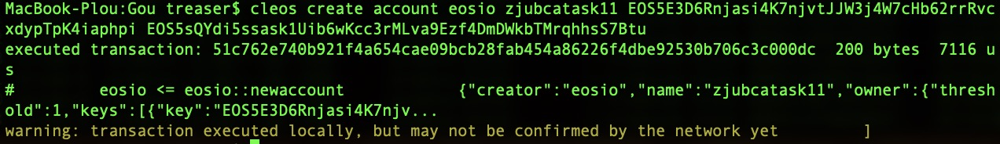

表明操作在本地节点已经成功。

可以使用cleos get account ACCOUNTNAME –json(-j)来获取账户信息：
【Shell-cleos窗口输出】
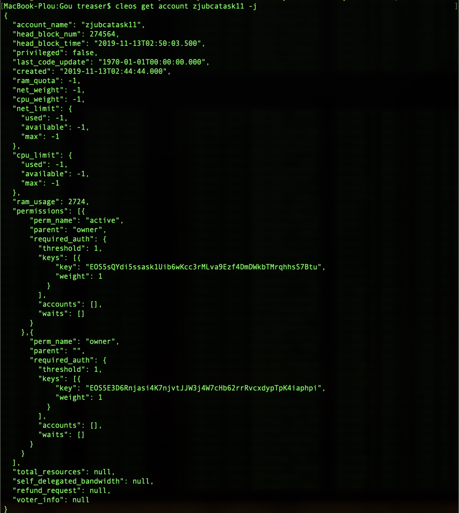

依次创建其他几个账户：zjubcauser11 jackmaeos111  eoselonmask1 eosstevejobs
【Shell-cleos窗口输出】
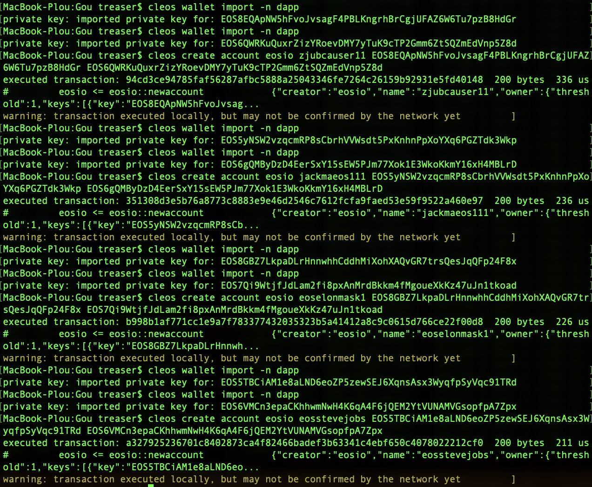


#### 3）部署智能合约

先编译一下：```eosio-cpp -o task.wasm task.cpp –abigen```

定位到contract目录下，进行部署（第一个参数是部署合约需要的账号，第二个参数是合约所在的文件夹）：
```shell
$ cleos set contract zjubcatask11 Task
$ cleos set contract zjubcauser11 User
```
部署完以后，**合约在区块链上的实例就是以部署合约的账户来标识的，一个EOS账户只能部署一个合约。**不像ETH分普通账户和合约账户，EOS中所有账户都可以部署合约。

【Shell-cleos窗口输出】
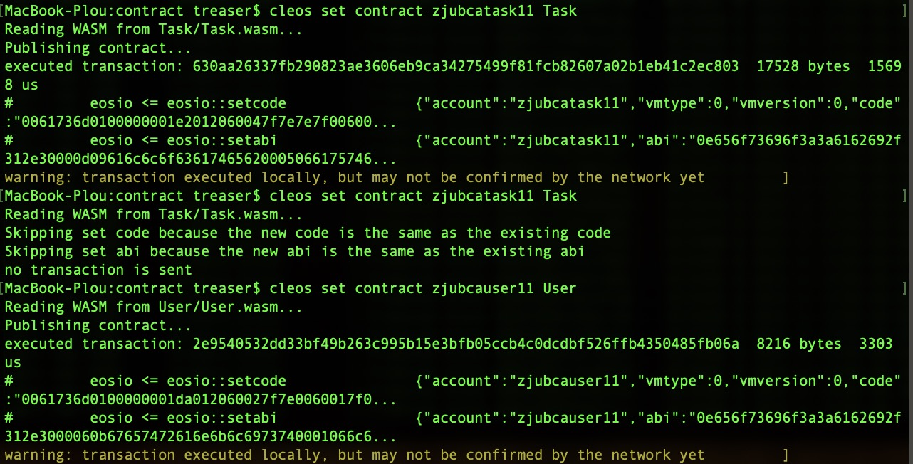

而且EOS支持同一个合约的多次部署（不过需要合约代码发生改变时才行，重复部署相同内容的合约会被拒绝）。

接下去进行任务创建的尝试：

```shell
$ cleos push action zjubcatask11 create '["zjubcatask11","1","zjubcatask11","Bounty Hunter DApp",
"活动悬赏Dapp是zjubca协会内部管理中最重要的Dapp之一。生动简明的活动悬赏流程和激励机制将极大地提高活动执行人的积极性，促进活动任务的顺利完成。","In Executing","3","1500 ZJUBCA","100 ZJUBCA","2019-02-18 10:00",
"完成源代码编写+智能合约部署+前端网页分发","20","8"]' -p zjubcatask11@active
```

【Shell-cleos窗口输出】
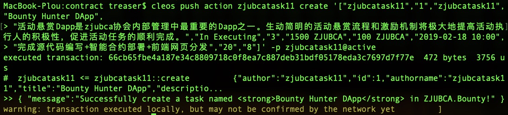
【Shell-nodeos窗口输出】
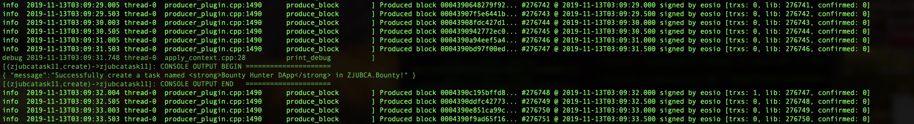

证明合约运行正常。

#### 4）远程节点部署

前面的部署都是在本地，如果在本地测试合约通过，那么可以将合约部署到EOS主网上。不过部署到EOS主网上需要使用EOS代币去质押一些RAM、NET、CPU资源。**EOS麒麟（Kylin）测试网是一个EOS的测试网，在上面不需要花钱就可以部署合约，可以免费获取测试网上的Token并用来购买资源。**

连接到远程节点进行操作的方法和在本地进行操作类似，只不过是要加 --url [NodeNetwork] 选项而已，比如说，去EOS麒麟（Kylin）测试网上获取账户信息：

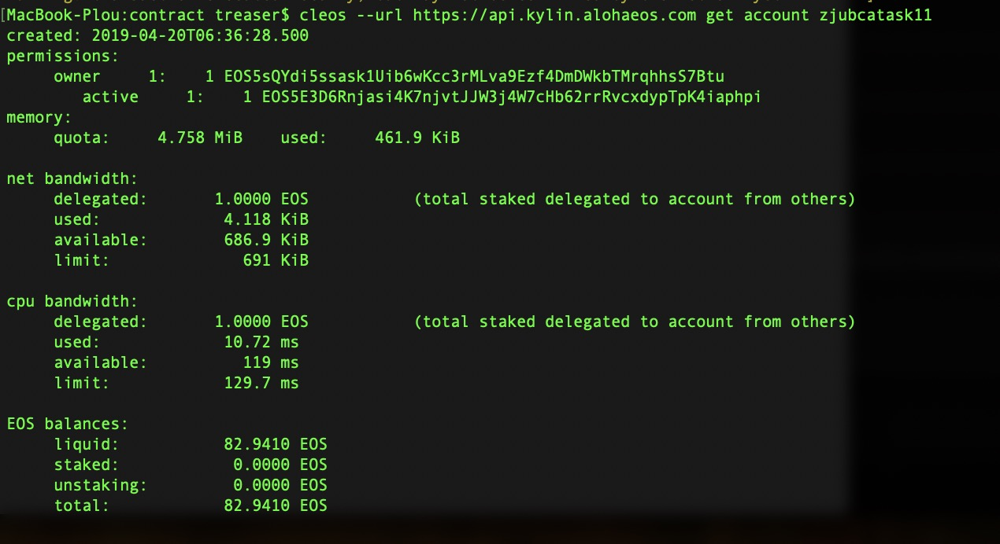

**在部署合约前需要先获取免费的token：**

```shell
$ curl http://faucet.cryptokylin.io/get_token?zjubcatask11 
```
zjubcatask11是账户名，由于我之前已经获取过了所以上面get account时已经有Token了。**然后需要使用Scatter钱包（后面会讲解Scatter钱包是什么）来质押一些资源。**

点击manage进入【质押界面】：
<div  align="center">    
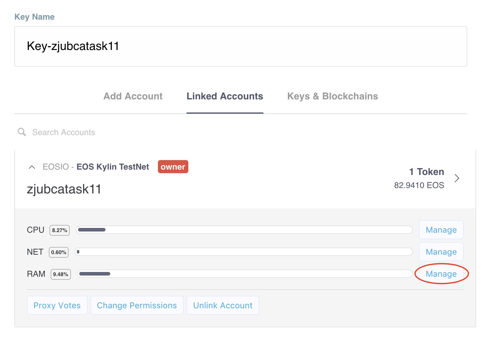
</div>
【质押界面】：
<div  align="center">    
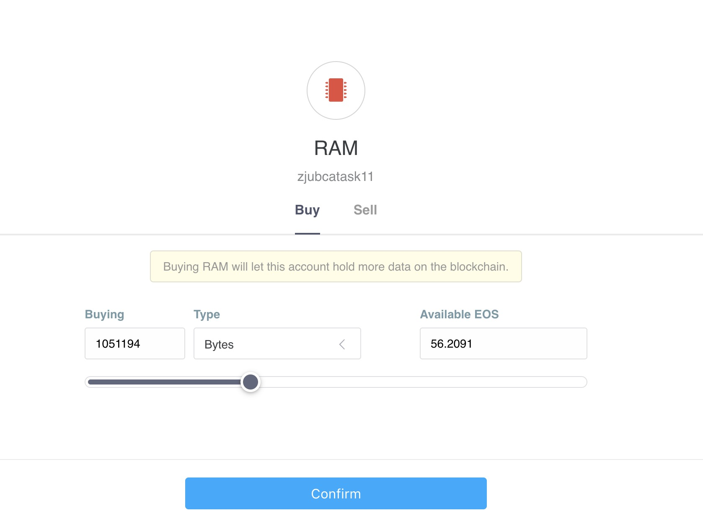
</div>


点击【Comfirm】就可以购买了。由于我之前已经购买过了。

最后类似地，**在测试网里部署合约：**

```shell
$ cleos --url https://api.kylin.alohaeos.com set contract zjubcatask11 Task
```
可以在专门监控EOS麒麟测试网的区块链浏览器上查看zjubcatask11下部署的合约情况：
https://kylin.eosx.io/account/zjubcatask11

<div  align="center">    
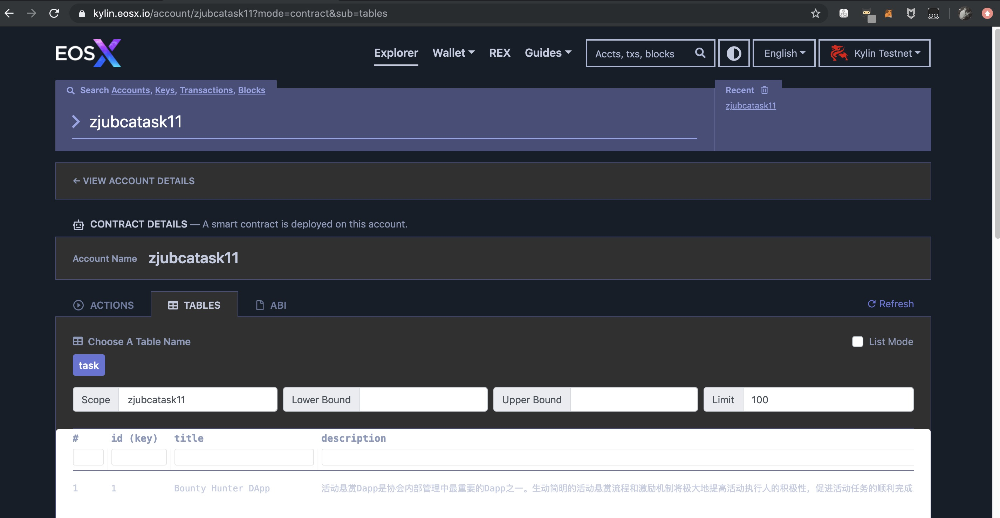
</div>

#### 5）启动React前端

在启动前端前需要在自己计算机上下载**Scatter钱包软件**（Scatter Desktop和Scatter Chrome都行）。**因为在前端里是无法用命令行中的钱包的（自己直接用命令行向节点调用合约方法时才可以）。**

在Scatter中需要配置两样东西：1.设置网络节点信息 2.导入账户的私钥

**设置网络节点信息：**
<div  align="center">    

</div>

**导入账户的私钥：**

<div  align="center">    
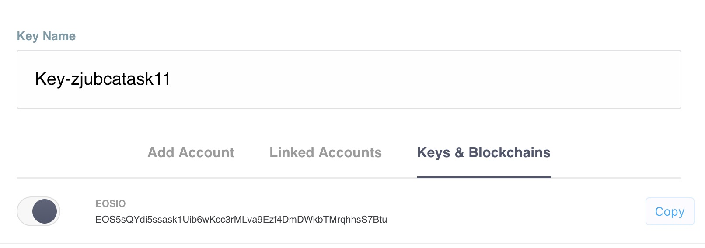
</div>


设置好钱包后，解锁之，然后在命令行中cd到 frontend 目录下，在Shell键入：

```shell
$ npm start
```
这时浏览器会自动打开 http://localhost:3000/#/
同时Scatter钱包也会被拉起（**这里我们已经预存了几个任务到区块链上了**）：

<div  align="center">    
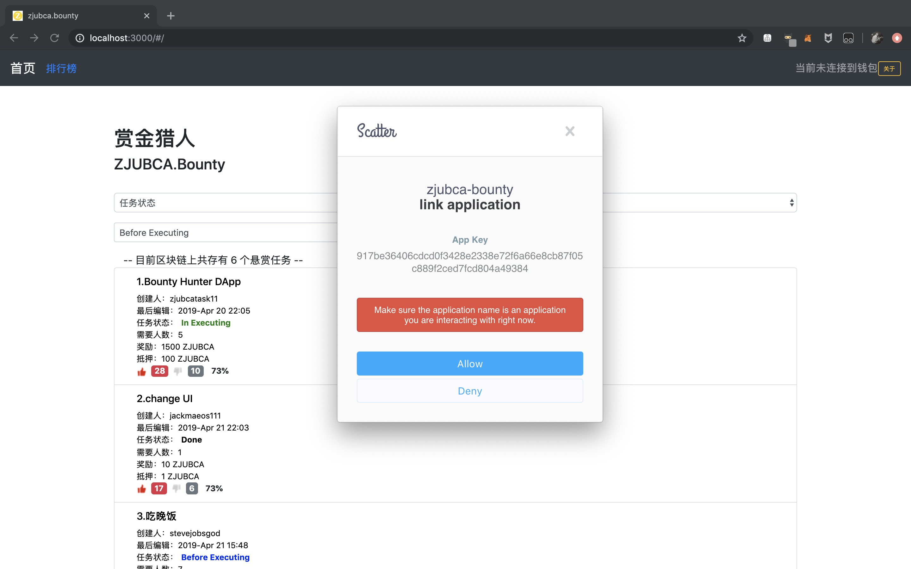
</div>

点击Allow允许钱包里的账户进行授权：
<div  align="center">    

</div>

#### 6）功能演示：
以下演示已经录制成视频，位于：https://www.bilibili.com/video/av75651876


**创建任务：**
点击【发布新的任务悬赏】的蓝绿色按钮会出现：

<div  align="center">    
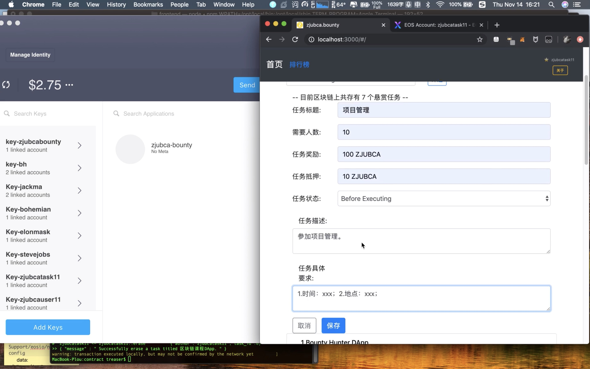
<br>
</div>


输入任务内容，点击【保存】，此时会拉起Scatter钱包来对交易进行签名：

<div  align="center">    
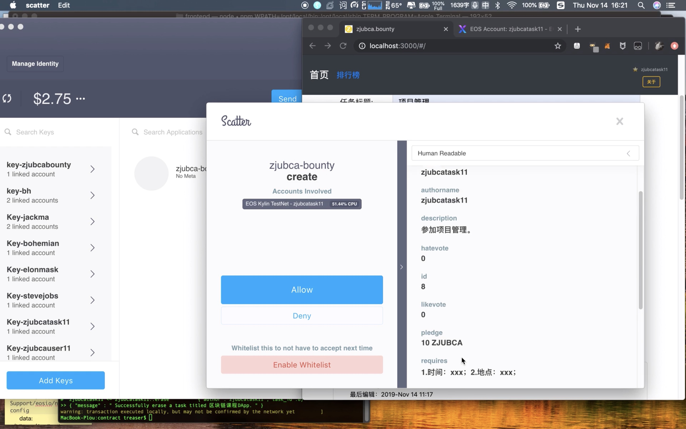
<br>
</div>


点击【Allow】，等待交易成功后，可以在本地的Web前端上看到已经有新的任务在了:

<div  align="center">    
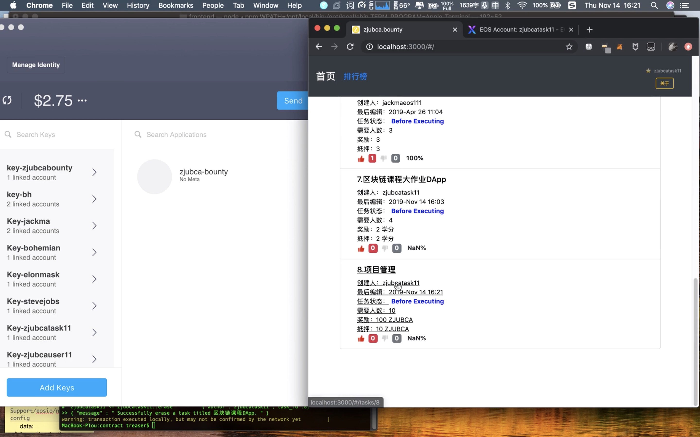
<br>
</div>

**同时，可以在EOS麒麟测试网的区块链浏览器下查看zjubcatask11账户下的action情况（https://kylin.eosx.io/account/zjubcatask11?sub=actions）：**

<div  align="center">    
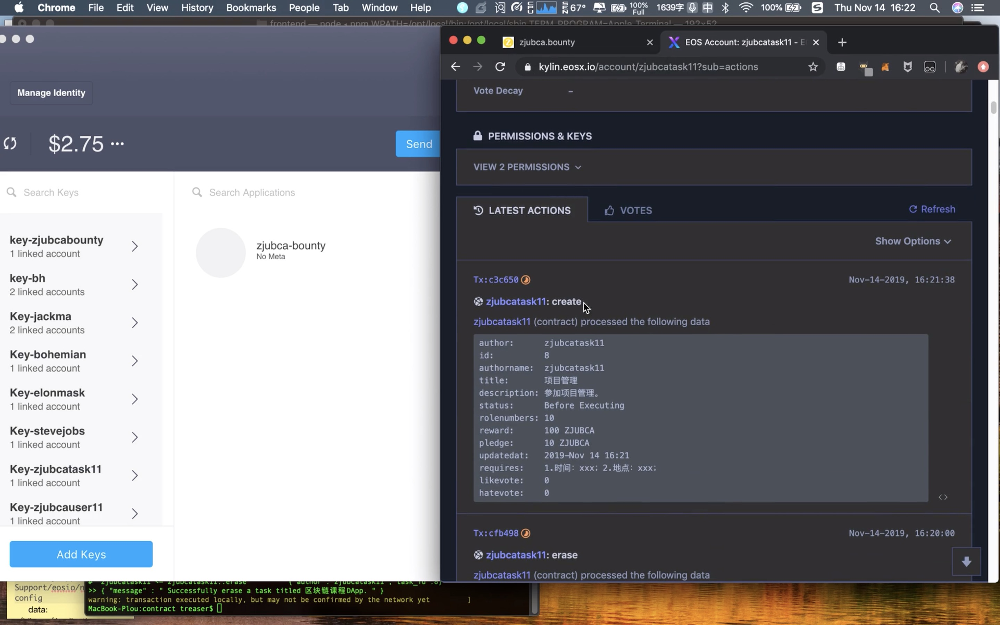
</div>

通过查询区块链上的记录证明我们的合约调用成功了。

其他的**删除、更新、参加、退出、验收任务**的演示详见[视频演示](https://www.bilibili.com/video/av75651876)，此处不再赘述。

最后再次查看EOS麒麟测试网的区块链浏览器（https://kylin.eosx.io/account/zjubcatask11?mode=contract&sub=interfaces）：可以发现所有的action都和我们在Web端发起的操作所吻合，也证明了我们任务的数据确实存储在了测试网上，而且前后端能正常配合实现我们DApp的设计要求。


## 4 参考

[1] EOS官网：https://eos.io

[2] 开发合约并部署到测试网【麒麟】： https://blog.csdn.net/weixin_43846763/article/details/84636803

[3] 麒麟测试网区块链浏览器：https://kylin.eosx.io/account/zjubcatask11